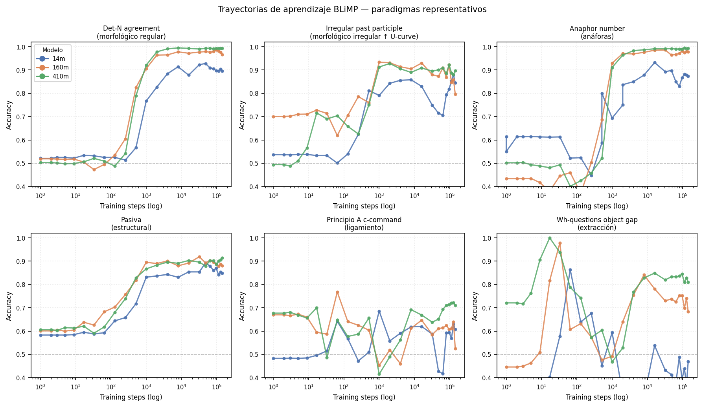
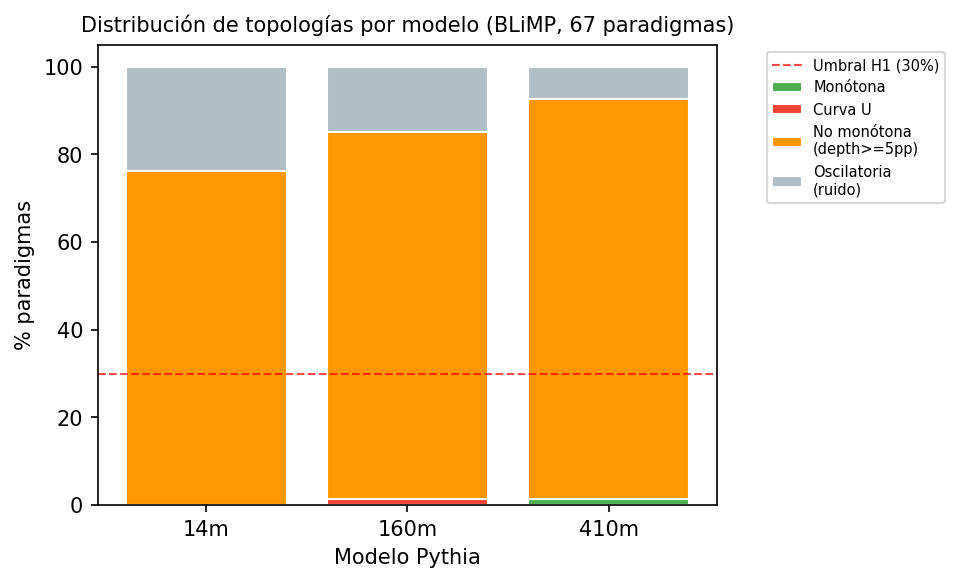

# Artificial Ontogeny

🌐 **Language:** **English** · [Español](README.es.md)

[](https://github.com/SMESCH1/ontogenia-artificial/actions/workflows/ci.yml)
[](LICENSE)
[](paper/main.pdf)
[](pyproject.toml)

**A longitudinal study of syntactic emergence in Pythia and its alignment with human language acquisition.**

Research project for the **Natural Language Processing** course (Universidad de San Andrés, 1st semester 2026, Luciano Del Corro). The full paper is written in Spanish in ACL format.

## Research question

Do the syntactic-acquisition trajectories of an autoregressive language model (Pythia), traced across its pre-training, exhibit **non-monotonic curves — including U-shaped curves — analogous to those documented in child language acquisition**? And does the relative order in which syntactic phenomena emerge in the model **correlate with the order in which children acquire them**?

This connects two literatures that rarely meet: developmental psycholinguistics (U-shaped learning, age of acquisition) and the analysis of learning dynamics in LLMs.

## Approach

- **Model:** Pythia suite (EleutherAI) — 154 public checkpoints with identical data ordering. Variants used: `pythia-14m`, `pythia-160m`, `pythia-410m` (deduped).
- **Evaluation:** syntactic minimal pairs (BLiMP + Zorro) run through `lm-evaluation-harness`.
- **Primary metric:** standard *pairwise accuracy* (`acc,none`) on joint log-probabilities.
- **Robustness / control metric:** *Sub-Linear Length-Normalized Log-Probability* (SLLN-LP) with α = 0.5 (adapted from Bunzeck & Zarrieß, 2024), implemented at the item level for sensitivity analysis and length control.
- **Human alignment:** Spearman correlation between the order in which paradigms stabilize in Pythia and the human age of acquisition reported in CHILDES / Wordbank.

## Key results

| Hypothesis | Result |
| --- | --- |
| **H1** — Non-monotonic curves exist | ✅ Confirmed: **76–91%** of paradigms are non-monotonic |
| **H2** — Ordinal alignment with humans | 🟡 Positive signal on a refined subset: **ρ = +0.169** (N = 31) |
| **H3** — Deeper U-curves for irregular morphology | ✅ Confirmed with high significance: **Mann–Whitney p < 0.005** (410M) |

📄 **Full paper (ACL format, Spanish):** [`paper/main.pdf`](paper/main.pdf)



*Per-paradigm learning curves (x-axis: tokens seen, log scale; y-axis: pairwise accuracy), one line per model size. Many paradigms dip and recover rather than rising monotonically.*



*Distribution of trajectory shapes (monotonic / U / inverted-U / oscillatory) across paradigms.*

## Reproducing the pipeline

```bash
python -m venv .venv && source .venv/bin/activate
pip install -r requirements.txt && pip install -e .

# Quick smoke test
./scripts/run_smoke.sh --limit 20            # → results/smoke/

# Full sweep (GPU, ~24h per model)
./scripts/run_full_sweep.sh                  # → results/sweep/

# Post-analysis: aggregation + topology + human alignment
./scripts/run_post_analysis.sh

# Tests
python -m unittest discover -s tests -v
```

Programmatic subcommands are exposed through `python -m ontogenia` (`sweep`, `aggregate`, `prefetch`, `topology`, `human-alignment`).

## Pipeline architecture

```
HuggingFace (revision=stepN)
        │  ▼
lm-evaluation-harness  ←── configs/*.yaml (custom BLiMP/Zorro tasks)
        │  ▼  JSON per (model, checkpoint, paradigm) → results/
        ▼
src/ontogenia/aggregate.py        → aggregated_metrics.parquet
        ├─▶ topology.py           → degree-5 polynomial fit + shape classifier
        └─▶ human_alignment.py    → Spearman + bootstrap vs. Wordbank AoA
        ▼
notebooks/02_trajectories.ipynb   ·  notebooks/03_human_correlation.ipynb
```

## Repository layout

```
docs/           Theoretical framework & experimental design (planning-phase documents)
docs/papers/    Reading notes on the 5 key papers
paper/          Final LaTeX manuscript (ACL format, Spanish) + main.pdf
src/ontogenia/  Pipeline: CLI, Pythia checkpoints, SLLN-LP, topology, human alignment
configs/        Custom task YAMLs for lm-evaluation-harness
notebooks/      Trajectories (02) and human correlation (03)
scripts/        run_smoke.sh, run_full_sweep.sh, run_post_analysis.sh, make_figures.py
tests/          Unit tests (metrics, aggregation, topology, alignment)
data/           human_milestones.csv (AoA) + wordbank_item_data.csv
figures/        Publication figures (PNG/PDF)
results/        Evaluation JSON + Parquet (gitignored)
```

> **Note:** the files under `docs/0X_*.md` are **planning-phase documents** reflecting the original design (where SLLN-LP was the intended primary metric). The final methodological decision — pairwise accuracy as the primary metric and SLLN-LP as a robustness control — is documented in the [paper](paper/main.pdf).

## Key references

- Bunzeck & Zarrieß (2024). *Fifty shapes of BLiMP: syntactic learning curves in language models are not uniform, but sometimes unruly.* CLASP.
- Biderman et al. (2023). *Pythia: A Suite for Analyzing Large Language Models Across Training and Scaling.* ICML.
- Hu et al. (2024). *Findings of the Second BabyLM Challenge.* CoNLL.
- Frank et al. (2017). *Wordbank: An open repository for developmental vocabulary data.*

Full bibliography in [`docs/deep-research.md`](docs/deep-research.md).

## Authors & contributions

Group research project by **Sebastián Mesch Henriques**, Leandro Miguel Carcagno, and Hugo Alejandro Cabaña — NLP course, UDESA, 1st semester 2026 (instructor: Luciano Del Corro).

**My role (Sebastián Mesch Henriques):** designed and implemented the full evaluation pipeline and repository — checkpoint sweep over the Pythia suite via `lm-evaluation-harness`, the SLLN-LP metric and aggregation layer, the topology classifier and the human-alignment (Spearman + bootstrap) analysis, the publication figures, and the experimental design. The research framing, human age-of-acquisition mapping, and paper were developed collaboratively with the team.

## License

Code released under the [MIT License](LICENSE). Third-party datasets (BLiMP, Zorro, Wordbank/CHILDES) and the Pythia models retain their respective licenses. Course materials are not included in this repository.
